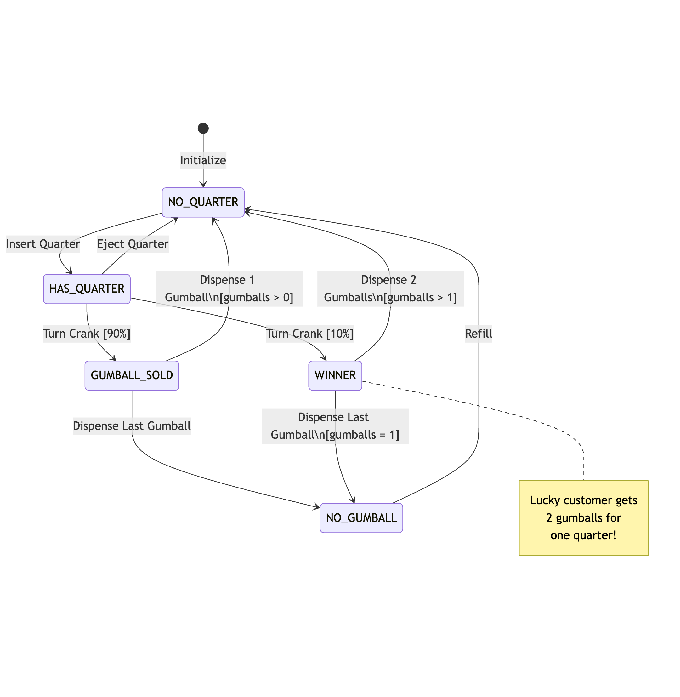

# Gumball Machine State Machine Sample

A Java implementation of a State Machine pattern using a Gumball Machine example.

## State Diagram


## Features

- State machine implementation with 4 states (NO_GUMBALL, NO_QUARTER, HAS_QUARTER, GUMBALL_SOLD)
- Quarter handling (insert/eject)
- Gumball dispensing mechanism
- Refill functionality
- Comprehensive unit tests with JaCoCo coverage reports
- Winner feature (10% chance to get two gumballs)

## Requirements

- Java 17
- Maven 3.x

## Building

```bash
mvn clean install
```

## Running Tests

```bash
mvn test
```

To view JaCoCo coverage report:
```bash
mvn clean test
# Open target/site/jacoco/index.html in browser
```

## Usage

```java
GumballMachine machine = new GumballMachine(5);
machine.insertQuarter();    // Insert quarter
machine.turnCrank();        // Get gumball
System.out.println(machine); // View machine status
```

## State Transitions

The machine operates according to the following state transitions:

- NO_QUARTER → HAS_QUARTER (after inserting quarter)
- HAS_QUARTER → NO_QUARTER (after ejecting quarter)
- HAS_QUARTER → GUMBALL_SOLD (after turning crank, 90% chance)
- HAS_QUARTER → WINNER (after turning crank, 10% chance)
- GUMBALL_SOLD → NO_QUARTER (after dispensing with gumballs remaining)
- GUMBALL_SOLD → NO_GUMBALL (after dispensing last gumball)
- WINNER → NO_QUARTER (after dispensing two gumballs)
- NO_GUMBALL → NO_QUARTER (after refill)